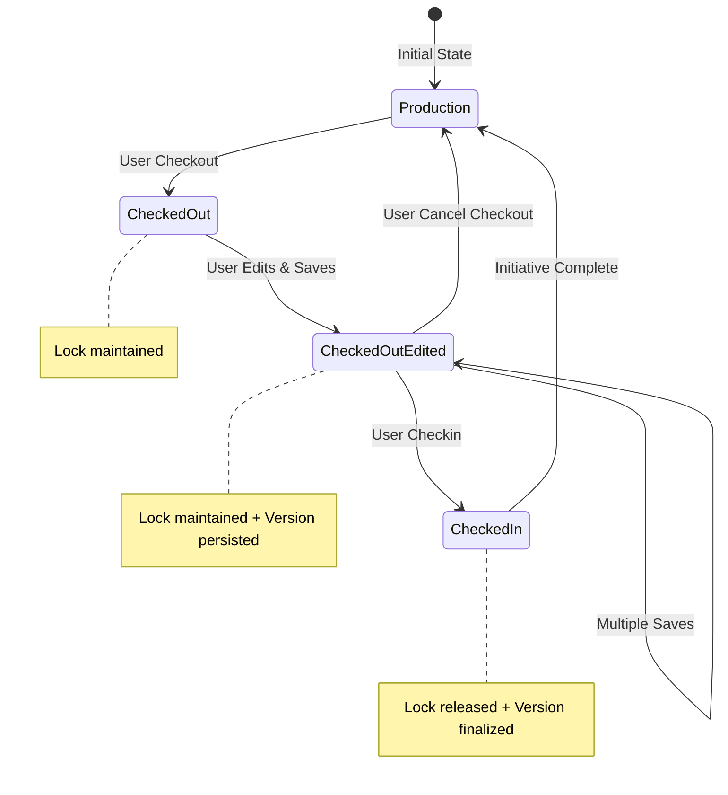

# Checkout Persistence Enhancement Plan

## 🎯 Overview

This document outlines the implementation to fix the checkout persistence issue where the checkout state is lost after editing. The system should maintain checkout state throughout the editing lifecycle and show appropriate versions based on initiative context.

---

## 🔴 Current Issues

1. **Checkout state lost after save** - The lock disappears after editing
2. **Wrong version displayed** - Shows production version instead of initiative version
3. **Inconsistent visual feedback** - Checkout status not properly maintained
4. **Improper state management** - System doesn't track edited vs checked-in states

---

## ✅ Desired Behavior

### **Checkout Lifecycle States**



### **Visual States**

| State | Color | Icon | Description |
|-------|-------|------|-------------|
| **Production** | Default | - | Baseline version |
| **Checked Out (Clean)** | 🟡 Yellow | 🔒 Lock | Locked, no edits yet |
| **Checked Out (Edited)** | 🟠 Orange | 📝 Edit Lock | Locked with saved changes |
| **Checked In** | 🔵 Blue | ✅ Check | Changes committed to initiative |
| **Locked by Other** | 🔴 Red | 🚫 Block | Cannot edit |

---

## 🏗️ Implementation Plan

### Phase 1: Backend Enhancements

#### 1.1 Enhanced Version Control Service

**File**: `/server/services/version-control.service.ts`

```typescript
export class VersionControlService {
  
  /**
   * Get the appropriate version based on context
   */
  static async getContextualVersion(
    artifactType: ArtifactType,
    artifactId: number,
    initiativeId: string | null,
    userId: number
  ): Promise<any> {
    
    // If in initiative context, check for initiative version
    if (initiativeId) {
      // First check if there's an initiative version
      const [initiativeVersion] = await db.select()
        .from(artifactVersions)
        .where(
          and(
            eq(artifactVersions.artifactType, artifactType),
            eq(artifactVersions.artifactId, artifactId),
            eq(artifactVersions.initiativeId, initiativeId),
            eq(artifactVersions.isBaseline, false)
          )
        )
        .orderBy(desc(artifactVersions.version))
        .limit(1);
      
      if (initiativeVersion) {
        // Return initiative version with metadata
        return {
          ...initiativeVersion.artifactData,
          _versionMetadata: {
            version: initiativeVersion.version,
            initiativeId: initiativeVersion.initiativeId,
            isInitiativeVersion: true,
            isBaseline: false,
            changedBy: initiativeVersion.changedBy,
            changeDescription: initiativeVersion.changeDescription,
            updatedAt: initiativeVersion.updatedAt
          }
        };
      }
    }
    
    // Fall back to production baseline
    return this.getProductionVersion(artifactType, artifactId);
  }
  
  /**
   * Save changes to initiative version (maintain lock)
   */
  static async saveInitiativeVersion(
    artifactType: ArtifactType,
    artifactId: number,
    initiativeId: string,
    userId: number,
    changes: any,
    maintainLock: boolean = true
  ): Promise<any> {
    
    // Verify user has lock
    const lock = await this.verifyUserLock(artifactType, artifactId, initiativeId, userId);
    if (!lock) {
      throw new Error("No checkout found for this artifact");
    }
    
    // Get or create initiative version
    let [initiativeVersion] = await db.select()
      .from(artifactVersions)
      .where(
        and(
          eq(artifactVersions.artifactType, artifactType),
          eq(artifactVersions.artifactId, artifactId),
          eq(artifactVersions.initiativeId, initiativeId),
          eq(artifactVersions.isBaseline, false)
        )
      )
      .limit(1);
    
    if (!initiativeVersion) {
      // Create new version if doesn't exist
      const productionVersion = await this.getProductionBaseline(artifactType, artifactId);
      [initiativeVersion] = await db.insert(artifactVersions).values({
        artifactType,
        artifactId,
        initiativeId,
        version: productionVersion.version + 1,
        artifactData: { ...productionVersion.artifactData, ...changes },
        changes: changes,
        changeDescription: "Initiative version created",
        changedBy: userId,
        isBaseline: false,
        createdAt: new Date(),
        updatedAt: new Date()
      }).returning();
    } else {
      // Update existing version
      [initiativeVersion] = await db.update(artifactVersions)
        .set({
          artifactData: { ...initiativeVersion.artifactData, ...changes },
          changes: { ...initiativeVersion.changes, ...changes },
          changedBy: userId,
          updatedAt: new Date()
        })
        .where(eq(artifactVersions.id, initiativeVersion.id))
        .returning();
    }
    
    // Maintain lock (don't remove it)
    if (maintainLock) {
      // Extend lock expiry
      await db.update(artifactLocks)
        .set({
          lockExpiry: new Date(Date.now() + 24 * 60 * 60 * 1000) // Extend by 24 hours
        })
        .where(
          and(
            eq(artifactLocks.artifactType, artifactType),
            eq(artifactLocks.artifactId, artifactId),
            eq(artifactLocks.initiativeId, initiativeId),
            eq(artifactLocks.lockedBy, userId)
          )
        );
    }
    
    return initiativeVersion;
  }
  
  /**
   * Enhanced state detection including edit status
   */
  static async getArtifactVersionState(
    artifactType: ArtifactType,
    artifactId: number,
    initiativeId: string | null
  ): Promise<{
    hasInitiativeVersion: boolean;
    hasUncommittedChanges: boolean;
    isCheckedOut: boolean;
    isCheckedIn: boolean;
    versionInfo: any;
  }> {
    
    if (!initiativeId) {
      return {
        hasInitiativeVersion: false,
        hasUncommittedChanges: false,
        isCheckedOut: false,
        isCheckedIn: false,
        versionInfo: null
      };
    }
    
    // Check for lock
    const [lock] = await db.select()
      .from(artifactLocks)
      .where(
        and(
          eq(artifactLocks.artifactType, artifactType),
          eq(artifactLocks.artifactId, artifactId),
          eq(artifactLocks.initiativeId, initiativeId)
        )
      )
      .limit(1);
    
    // Check for initiative version
    const [initiativeVersion] = await db.select()
      .from(artifactVersions)
      .where(
        and(
          eq(artifactVersions.artifactType, artifactType),
          eq(artifactVersions.artifactId, artifactId),
          eq(artifactVersions.initiativeId, initiativeId),
          eq(artifactVersions.isBaseline, false)
        )
      )
      .orderBy(desc(artifactVersions.version))
      .limit(1);
    
    return {
      hasInitiativeVersion: !!initiativeVersion,
      hasUncommittedChanges: !!initiativeVersion && !!lock, // Has changes and still locked
      isCheckedOut: !!lock,
      isCheckedIn: !!initiativeVersion && !lock, // Has version but no lock
      versionInfo: initiativeVersion
    };
  }
}
```

#### 1.2 Update Artifact Routes

**Example**: `/server/routes/applications.ts`

```typescript
// Get application with version context
applicationsRouter.get("/:id", requireAuth, async (req, res) => {
  try {
    const { id } = req.params;
    const { initiativeId } = req.query;
    
    // Get contextual version based on initiative
    const application = await VersionControlService.getContextualVersion(
      'application',
      parseInt(id),
      initiativeId as string || null,
      req.user!.id
    );
    
    if (!application) {
      return res.status(404).json({ error: "Application not found" });
    }
    
    // Add version state information
    const versionState = await VersionControlService.getArtifactVersionState(
      'application',
      parseInt(id),
      initiativeId as string || null
    );
    
    res.json({
      ...application,
      _versionState: versionState
    });
  } catch (error) {
    res.status(500).json({ error: "Failed to fetch application" });
  }
});

// Update application (maintain checkout)
applicationsRouter.put("/:id", requireAuth, async (req, res) => {
  try {
    const { id } = req.params;
    const { initiativeId, ...updateData } = req.body;
    const userId = req.user!.id;
    
    // If in initiative context, save to initiative version
    if (initiativeId) {
      const initiativeVersion = await VersionControlService.saveInitiativeVersion(
        'application',
        parseInt(id),
        initiativeId,
        userId,
        updateData,
        true // Maintain lock
      );
      
      return res.json({
        success: true,
        message: "Changes saved to initiative version. Checkout maintained.",
        version: initiativeVersion,
        checkoutStatus: "checked_out_edited"
      });
    }
    
    // Otherwise, update production (existing logic)
    await db.update(applications)
      .set(updateData)
      .where(eq(applications.id, parseInt(id)));
    
    res.json({
      success: true,
      message: "Application updated in production"
    });
  } catch (error) {
    res.status(500).json({ error: error.message });
  }
});
```

### Phase 2: Frontend Enhancements

#### 2.1 Enhanced State Detection

**File**: `/client/src/lib/artifact-state-utils.ts`

```typescript
// Enhanced state detection with edit status
export interface ArtifactState {
  isCheckedOut: boolean;
  isCheckedOutByMe: boolean;
  isLockedByOther: boolean;
  hasInitiativeChanges: boolean;
  hasUncommittedChanges: boolean; // New: Has saved but not checked in
  isCheckedIn: boolean; // New: Checked in but not baselined
  hasConflicts: boolean;
  isProductionBaseline: boolean;
  lockedBy?: string;
  state: 'production' | 'checked_out_clean' | 'checked_out_edited' | 
        'checked_in' | 'locked_other' | 'conflicted';
}

export function getArtifactState(
  artifactId: number,
  artifactType: string,
  lock: ArtifactLock | null,
  currentUserId: number | undefined,
  versionState?: any // Version state from backend
): ArtifactState {
  
  const isCheckedOut = !!lock;
  const isCheckedOutByMe = isCheckedOut && lock.lock.lockedBy === currentUserId;
  const isLockedByOther = isCheckedOut && !isCheckedOutByMe;
  
  // Enhanced state detection using version state
  const hasInitiativeChanges = versionState?.hasInitiativeVersion || false;
  const hasUncommittedChanges = versionState?.hasUncommittedChanges || false;
  const isCheckedIn = versionState?.isCheckedIn || false;
  
  // Determine primary state
  let state: ArtifactState['state'] = 'production';
  
  if (isLockedByOther) {
    state = 'locked_other';
  } else if (isCheckedOutByMe && hasUncommittedChanges) {
    state = 'checked_out_edited';
  } else if (isCheckedOutByMe) {
    state = 'checked_out_clean';
  } else if (isCheckedIn) {
    state = 'checked_in';
  }
  
  return {
    isCheckedOut,
    isCheckedOutByMe,
    isLockedByOther,
    hasInitiativeChanges,
    hasUncommittedChanges,
    isCheckedIn,
    hasConflicts: false, // TODO: Implement conflict detection
    isProductionBaseline: state === 'production',
    lockedBy: lock?.user?.username,
    state
  };
}

// Enhanced visual mapping
export function getArtifactVisuals(state: ArtifactState): ArtifactVisuals {
  switch (state.state) {
    case 'checked_out_clean':
      return {
        rowClassName: 'bg-yellow-950/30 border-l-4 border-yellow-500 hover:bg-yellow-950/40',
        iconComponent: Lock,
        iconColor: 'text-yellow-400',
        badgeText: 'CHECKED OUT',
        badgeColor: 'bg-yellow-900 text-yellow-200 border-yellow-600',
        tooltip: 'Checked out by you - ready for editing',
        statusText: 'Checked Out',
        statusColor: 'bg-yellow-600 text-yellow-100'
      };

    case 'checked_out_edited':
      return {
        rowClassName: 'bg-orange-950/30 border-l-4 border-orange-500 hover:bg-orange-950/40',
        iconComponent: Edit,
        iconColor: 'text-orange-400',
        badgeText: 'EDITED',
        badgeColor: 'bg-orange-900 text-orange-200 border-orange-600',
        tooltip: 'Checked out by you with saved changes - ready for checkin',
        statusText: 'Edited',
        statusColor: 'bg-orange-600 text-orange-100'
      };

    case 'checked_in':
      return {
        rowClassName: 'bg-blue-950/30 border-l-4 border-blue-500 hover:bg-blue-950/40',
        iconComponent: CheckCircle,
        iconColor: 'text-blue-400',
        badgeText: 'CHECKED IN',
        badgeColor: 'bg-blue-900 text-blue-200 border-blue-600',
        tooltip: 'Changes checked in to initiative - awaiting baseline',
        statusText: 'Checked In',
        statusColor: 'bg-blue-600 text-blue-100'
      };

    case 'locked_other':
      return {
        rowClassName: 'bg-red-950/30 border-l-4 border-red-500 hover:bg-red-950/40',
        iconComponent: Lock,
        iconColor: 'text-red-400',
        badgeText: 'LOCKED',
        badgeColor: 'bg-red-900 text-red-200 border-red-600',
        tooltip: `Locked by ${state.lockedBy} - cannot edit`,
        statusText: 'Locked',
        statusColor: 'bg-red-600 text-red-100'
      };

    case 'production':
    default:
      return {
        rowClassName: 'hover:bg-gray-800/50',
        iconComponent: null,
        iconColor: '',
        badgeColor: 'bg-green-900 text-green-200 border-green-600',
        tooltip: 'Production baseline',
        statusText: 'Production',
        statusColor: 'bg-green-600 text-green-100'
      };
  }
}
```

#### 2.2 Update Application Form

**File**: `/client/src/components/applications/application-form.tsx`

```typescript
export default function ApplicationForm({ 
  initialData, 
  applicationId,
  isEditing, 
  onSuccess 
}: ApplicationFormProps) {
  
  const { currentInitiative, isProductionView } = useInitiative();
  const [versionState, setVersionState] = useState<any>(null);
  
  // Fetch version state on mount
  useEffect(() => {
    if (applicationId && currentInitiative && !isProductionView) {
      fetchVersionState();
    }
  }, [applicationId, currentInitiative]);
  
  const fetchVersionState = async () => {
    try {
      const response = await api.get(`/api/applications/${applicationId}`, {
        params: { initiativeId: currentInitiative?.initiativeId }
      });
      
      setVersionState(response.data._versionState);
      
      // If has initiative version, use that data
      if (response.data._versionMetadata?.isInitiativeVersion) {
        setFormData(response.data);
      }
    } catch (error) {
      console.error('Failed to fetch version state:', error);
    }
  };
  
  const handleSubmit = async (e: React.FormEvent) => {
    e.preventDefault();
    
    try {
      if (isEditing) {
        // Include initiative context
        const updateData = {
          ...formData,
          initiativeId: currentInitiative?.initiativeId
        };
        
        await api.put(`/api/applications/${applicationId}`, updateData);
        
        toast({
          title: "Success",
          description: currentInitiative && !isProductionView
            ? "Changes saved to initiative version. Checkout maintained."
            : "Application updated successfully"
        });
        
        // Refresh version state
        if (currentInitiative && !isProductionView) {
          fetchVersionState();
        }
        
        onSuccess();
      } else {
        // Create logic...
      }
    } catch (error) {
      toast({
        title: "Error",
        description: error.response?.data?.error || "Failed to save changes",
        variant: "destructive"
      });
    }
  };
  
  // Show checkout status in form header
  const renderCheckoutStatus = () => {
    if (!currentInitiative || isProductionView || !versionState) return null;
    
    const { isCheckedOut, hasUncommittedChanges } = versionState;
    
    if (isCheckedOut && hasUncommittedChanges) {
      return (
        <div className="bg-orange-900/20 border border-orange-700 rounded p-3">
          <div className="flex items-center space-x-2">
            <Edit className="h-4 w-4 text-orange-400" />
            <span className="text-orange-200 text-sm">
              Checked out with saved changes - Ready for checkin
            </span>
          </div>
        </div>
      );
    } else if (isCheckedOut) {
      return (
        <div className="bg-yellow-900/20 border border-yellow-700 rounded p-3">
          <div className="flex items-center space-x-2">
            <Lock className="h-4 w-4 text-yellow-400" />
            <span className="text-yellow-200 text-sm">
              Checked out - Ready for editing
            </span>
          </div>
        </div>
      );
    }
    
    return null;
  };
  
  return (
    <form onSubmit={handleSubmit} className="space-y-6">
      {renderCheckoutStatus()}
      
      {/* Rest of form fields... */}
      
      <div className="flex justify-end space-x-3">
        <Button type="button" variant="outline" onClick={onCancel}>
          Cancel
        </Button>
        <Button type="submit" disabled={isSubmitting}>
          {isSubmitting ? (
            <>
              <Loader2 className="mr-2 h-4 w-4 animate-spin" />
              Saving...
            </>
          ) : (
            'Save Changes'
          )}
        </Button>
      </div>
    </form>
  );
}
```

#### 2.3 Update List Pages

**Example**: `/client/src/pages/applications.tsx`

```typescript
// Enhanced data fetching with version states
const { data: applications = [], isLoading } = useQuery({
  queryKey: ["/api/applications", currentInitiative?.initiativeId],
  queryFn: async () => {
    const response = await fetch("/api/applications");
    const apps = await response.json();
    
    // If in initiative context, fetch version states
    if (currentInitiative && !isProductionView) {
      const enhancedApps = await Promise.all(
        apps.map(async (app: any) => {
          try {
            const versionResponse = await api.get(`/api/applications/${app.id}`, {
              params: { initiativeId: currentInitiative.initiativeId }
            });
            
            return {
              ...app,
              _versionState: versionResponse.data._versionState,
              _versionMetadata: versionResponse.data._versionMetadata
            };
          } catch (error) {
            return app;
          }
        })
      );
      
      return enhancedApps;
    }
    
    return apps;
  },
});

// Enhanced state detection for visuals
const getApplicationState = (app: Application): ArtifactState => {
  const lock = isApplicationLocked(app.id);
  
  return getArtifactState(
    app.id,
    'application',
    lock,
    currentUser?.id,
    app._versionState // Pass version state
  );
};

// Enhanced context menu
{isLockedByMe && app._versionState?.hasUncommittedChanges && (
  <ContextMenuItem 
    onClick={() => handleCheckin(app)}
    className="text-blue-400 hover:bg-blue-900/20"
  >
    <CheckCircle className="mr-2 h-4 w-4" />
    Checkin Changes
  </ContextMenuItem>
)}
```

### Phase 3: Apply to All Artifact Types

The same pattern needs to be applied to:

1. **Interfaces** (`/server/routes/interfaces.ts`, `/client/src/pages/interfaces.tsx`)
2. **Business Processes** (`/server/routes/business-processes.ts`, `/client/src/pages/business-processes.tsx`)
3. **Internal Activities** (`/server/routes/internal-activities.ts`, `/client/src/pages/internal-activities.tsx`)
4. **Technical Processes** (`/server/routes/technical-processes.ts`, `/client/src/pages/technical-processes.tsx`)

Each artifact type should:
- Return contextual versions based on initiative
- Maintain locks after saves
- Track edited vs checked-in states
- Display appropriate visual indicators

---

## 🎯 Success Criteria

1. **✅ Checkout persists** through multiple save operations
2. **✅ Initiative version displayed** when in initiative context
3. **✅ Visual indicators** show correct state (checked out vs edited vs checked in)
4. **✅ Lock maintained** until explicit cancel or checkin
5. **✅ Version history** properly tracked
6. **✅ Consistent behavior** across all artifact types

---

## 📊 Testing Scenarios

### Scenario 1: Basic Checkout and Edit
1. Checkout artifact in initiative
2. Edit and save changes
3. **Expected**: Checkout state maintained, orange "EDITED" indicator
4. Save again
5. **Expected**: Still checked out, changes accumulated

### Scenario 2: View in Different Contexts
1. Edit artifact in Initiative A
2. Switch to Production view
3. **Expected**: See production version
4. Switch back to Initiative A
5. **Expected**: See initiative version with edits

### Scenario 3: Checkin Process
1. Checkout and edit artifact
2. Click Checkin
3. **Expected**: Lock released, blue "CHECKED IN" indicator
4. Try to edit
5. **Expected**: Requires new checkout

---

## 🚀 Implementation Priority

1. **Week 1**: Backend version context and lock persistence
2. **Week 2**: Frontend state detection and visual updates
3. **Week 3**: Apply to all artifact types
4. **Week 4**: Testing and refinement

This enhancement ensures proper version control workflow with clear visual feedback throughout the artifact lifecycle.