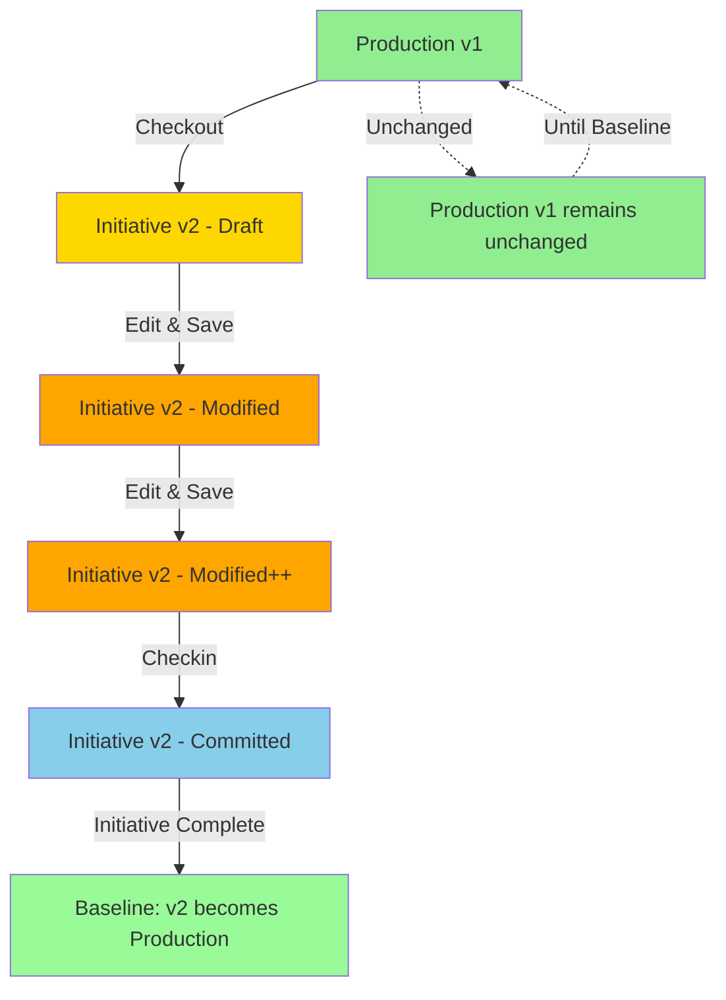

# Initiative Version Isolation Design

## 🎯 Core Principle: Complete Production Isolation

**Initiative changes are completely isolated from production until baseline.**

---

## 📊 Version Control Flow



---

## 🏗️ Implementation Design

### 1. Database Schema

```sql
-- artifact_versions table structure
CREATE TABLE artifact_versions (
    id SERIAL PRIMARY KEY,
    artifact_type VARCHAR(50) NOT NULL,
    artifact_id INTEGER NOT NULL,
    version INTEGER NOT NULL,
    initiative_id VARCHAR(255), -- NULL for production versions
    artifact_data JSONB NOT NULL,
    changes JSONB,
    change_description TEXT,
    changed_by INTEGER,
    is_baseline BOOLEAN DEFAULT false,
    is_committed BOOLEAN DEFAULT false, -- NEW: Track if checked in
    created_at TIMESTAMP DEFAULT NOW(),
    updated_at TIMESTAMP DEFAULT NOW(),
    baselined_at TIMESTAMP,
    baselined_by INTEGER,
    
    -- Constraints
    CONSTRAINT unique_production_baseline 
        UNIQUE (artifact_type, artifact_id, is_baseline) 
        WHERE is_baseline = true,
    
    CONSTRAINT unique_initiative_version 
        UNIQUE (artifact_type, artifact_id, initiative_id) 
        WHERE initiative_id IS NOT NULL
);

-- Example data
-- Production version (always v1 until baselined)
INSERT INTO artifact_versions VALUES (
    1, 'application', 100, 1, NULL, 
    '{"name": "App A", "status": "active"}', 
    NULL, 'Production baseline', 1, 
    true, true, '2024-01-01', '2024-01-01', '2024-01-01', 1
);

-- Initiative version (v2, isolated from production)
INSERT INTO artifact_versions VALUES (
    2, 'application', 100, 2, 'INIT-2024-001', 
    '{"name": "App A Enhanced", "status": "active", "newFeature": true}', 
    '{"name": "App A Enhanced", "newFeature": true}', 
    'Added new feature', 2, 
    false, false, '2024-01-15', '2024-01-15', NULL, NULL
);
```

### 2. Version Control Service

```typescript
export class VersionControlService {
  
  /**
   * Checkout creates v2 in initiative (v1 remains in production)
   */
  static async checkoutArtifact(
    artifactType: ArtifactType,
    artifactId: number,
    initiativeId: string,
    userId: number
  ): Promise<ArtifactVersion> {
    
    // Get production baseline (v1)
    const [productionVersion] = await db.select()
      .from(artifactVersions)
      .where(
        and(
          eq(artifactVersions.artifactType, artifactType),
          eq(artifactVersions.artifactId, artifactId),
          eq(artifactVersions.isBaseline, true)
        )
      )
      .limit(1);
    
    if (!productionVersion) {
      throw new Error("No production baseline found");
    }
    
    // Check if initiative version already exists
    const [existingInitVersion] = await db.select()
      .from(artifactVersions)
      .where(
        and(
          eq(artifactVersions.artifactType, artifactType),
          eq(artifactVersions.artifactId, artifactId),
          eq(artifactVersions.initiativeId, initiativeId)
        )
      )
      .limit(1);
    
    if (existingInitVersion) {
      throw new Error("Artifact already has a version in this initiative");
    }
    
    // Create v2 in initiative (copy from v1)
    const [initiativeVersion] = await db.insert(artifactVersions).values({
      artifactType,
      artifactId,
      version: productionVersion.version + 1, // v2
      initiativeId,
      artifactData: productionVersion.artifactData, // Copy v1 data
      changes: {},
      changeDescription: `Checked out from production v${productionVersion.version}`,
      changedBy: userId,
      isBaseline: false, // NOT a baseline
      isCommitted: false, // NOT committed yet
      createdAt: new Date(),
      updatedAt: new Date()
    }).returning();
    
    // Create lock
    await this.createLock(artifactType, artifactId, initiativeId, userId);
    
    return initiativeVersion;
  }
  
  /**
   * Save updates initiative version only (v1 untouched)
   */
  static async saveArtifactChanges(
    artifactType: ArtifactType,
    artifactId: number,
    initiativeId: string,
    userId: number,
    changes: any
  ): Promise<ArtifactVersion> {
    
    // Get initiative version (v2)
    const [initiativeVersion] = await db.select()
      .from(artifactVersions)
      .where(
        and(
          eq(artifactVersions.artifactType, artifactType),
          eq(artifactVersions.artifactId, artifactId),
          eq(artifactVersions.initiativeId, initiativeId)
        )
      )
      .limit(1);
    
    if (!initiativeVersion) {
      throw new Error("No initiative version found. Checkout required.");
    }
    
    // Update ONLY the initiative version
    const [updatedVersion] = await db.update(artifactVersions)
      .set({
        artifactData: { ...initiativeVersion.artifactData, ...changes },
        changes: { ...initiativeVersion.changes, ...changes },
        changedBy: userId,
        updatedAt: new Date()
        // Still not committed, just saved
      })
      .where(eq(artifactVersions.id, initiativeVersion.id))
      .returning();
    
    // Maintain lock
    await this.extendLock(artifactType, artifactId, initiativeId, userId);
    
    return updatedVersion;
  }
  
  /**
   * Checkin commits the initiative version (v1 still untouched)
   */
  static async checkinArtifact(
    artifactType: ArtifactType,
    artifactId: number,
    initiativeId: string,
    userId: number,
    finalChanges?: any,
    changeDescription?: string
  ): Promise<ArtifactVersion> {
    
    // Get initiative version
    const [initiativeVersion] = await db.select()
      .from(artifactVersions)
      .where(
        and(
          eq(artifactVersions.artifactType, artifactType),
          eq(artifactVersions.artifactId, artifactId),
          eq(artifactVersions.initiativeId, initiativeId)
        )
      )
      .limit(1);
    
    if (!initiativeVersion) {
      throw new Error("No initiative version found");
    }
    
    // Apply final changes if any
    const finalData = finalChanges 
      ? { ...initiativeVersion.artifactData, ...finalChanges }
      : initiativeVersion.artifactData;
    
    // Mark as committed (but NOT baseline)
    const [committedVersion] = await db.update(artifactVersions)
      .set({
        artifactData: finalData,
        changes: finalChanges ? { ...initiativeVersion.changes, ...finalChanges } : initiativeVersion.changes,
        changeDescription: changeDescription || initiativeVersion.changeDescription,
        changedBy: userId,
        isCommitted: true, // Now committed
        updatedAt: new Date()
      })
      .where(eq(artifactVersions.id, initiativeVersion.id))
      .returning();
    
    // Remove lock
    await this.removeLock(artifactType, artifactId, initiativeId);
    
    return committedVersion;
  }
  
  /**
   * Get version based on context (NEVER mix production and initiative)
   */
  static async getContextualVersion(
    artifactType: ArtifactType,
    artifactId: number,
    initiativeId: string | null
  ): Promise<any> {
    
    if (initiativeId) {
      // In initiative context - get initiative version
      const [initiativeVersion] = await db.select()
        .from(artifactVersions)
        .where(
          and(
            eq(artifactVersions.artifactType, artifactType),
            eq(artifactVersions.artifactId, artifactId),
            eq(artifactVersions.initiativeId, initiativeId)
          )
        )
        .limit(1);
      
      if (initiativeVersion) {
        return {
          ...initiativeVersion.artifactData,
          _metadata: {
            version: initiativeVersion.version,
            initiativeId: initiativeVersion.initiativeId,
            isCommitted: initiativeVersion.isCommitted,
            isBaseline: false,
            source: 'initiative'
          }
        };
      }
    }
    
    // Default to production baseline (v1)
    const [productionVersion] = await db.select()
      .from(artifactVersions)
      .where(
        and(
          eq(artifactVersions.artifactType, artifactType),
          eq(artifactVersions.artifactId, artifactId),
          eq(artifactVersions.isBaseline, true)
        )
      )
      .limit(1);
    
    if (productionVersion) {
      return {
        ...productionVersion.artifactData,
        _metadata: {
          version: productionVersion.version,
          isBaseline: true,
          source: 'production'
        }
      };
    }
    
    return null;
  }
  
  /**
   * Baseline initiative - Make all v2s become new v1s
   */
  static async baselineInitiative(initiativeId: string): Promise<void> {
    
    // Get all committed versions in initiative
    const initiativeVersions = await db.select()
      .from(artifactVersions)
      .where(
        and(
          eq(artifactVersions.initiativeId, initiativeId),
          eq(artifactVersions.isCommitted, true)
        )
      );
    
    // For each initiative version
    for (const initVersion of initiativeVersions) {
      // Archive current production baseline
      await db.update(artifactVersions)
        .set({ 
          isBaseline: false,
          archivedAt: new Date()
        })
        .where(
          and(
            eq(artifactVersions.artifactType, initVersion.artifactType),
            eq(artifactVersions.artifactId, initVersion.artifactId),
            eq(artifactVersions.isBaseline, true)
          )
        );
      
      // Make initiative version the new baseline
      await db.update(artifactVersions)
        .set({
          isBaseline: true,
          baselinedAt: new Date(),
          version: 1 // Reset to v1 as new production
        })
        .where(eq(artifactVersions.id, initVersion.id));
    }
  }
}
```

### 3. Route Implementation

```typescript
// Get artifact - respects initiative isolation
router.get("/applications/:id", async (req, res) => {
  const { id } = req.params;
  const { initiativeId } = req.query;
  
  const data = await VersionControlService.getContextualVersion(
    'application',
    parseInt(id),
    initiativeId as string || null
  );
  
  res.json(data);
});

// Update artifact - ONLY updates initiative version
router.put("/applications/:id", async (req, res) => {
  const { id } = req.params;
  const { initiativeId, ...changes } = req.body;
  
  if (initiativeId) {
    // Update initiative version ONLY
    const version = await VersionControlService.saveArtifactChanges(
      'application',
      parseInt(id),
      initiativeId,
      req.user!.id,
      changes
    );
    
    return res.json({
      success: true,
      message: "Changes saved to initiative version",
      version: version.version,
      production: "unchanged"
    });
  }
  
  // Production updates require no initiative context
  // ... existing production update logic
});
```

### 4. Frontend Display

```typescript
// Show version info in UI
const VersionIndicator = ({ metadata }) => {
  if (!metadata) return null;
  
  return (
    <div className="flex items-center space-x-2 text-sm">
      {metadata.source === 'initiative' ? (
        <>
          <Badge className="bg-blue-600">
            Initiative v{metadata.version}
          </Badge>
          {metadata.isCommitted && (
            <Badge className="bg-green-600">Checked In</Badge>
          )}
        </>
      ) : (
        <Badge className="bg-gray-600">
          Production v{metadata.version}
        </Badge>
      )}
    </div>
  );
};

// Context-aware data display
const ApplicationView = ({ applicationId }) => {
  const { currentInitiative, isProductionView } = useInitiative();
  
  const { data } = useQuery({
    queryKey: ['application', applicationId, currentInitiative?.initiativeId],
    queryFn: async () => {
      const response = await api.get(`/api/applications/${applicationId}`, {
        params: { 
          initiativeId: !isProductionView ? currentInitiative?.initiativeId : null 
        }
      });
      return response.data;
    }
  });
  
  return (
    <div>
      <VersionIndicator metadata={data?._metadata} />
      {/* Display appropriate version data */}
      <h1>{data?.name}</h1>
      {data?._metadata?.source === 'initiative' && (
        <Alert>
          <AlertCircle className="h-4 w-4" />
          <AlertDescription>
            You are viewing initiative changes. Production remains at v1.
          </AlertDescription>
        </Alert>
      )}
    </div>
  );
};
```

---

## 🔐 Key Isolation Rules

### 1. **Version Separation**
- Production always remains at v1 until baseline
- Initiative creates v2, v3, etc. in isolation
- No mixing of production and initiative data

### 2. **Checkin Behavior**
- Checkin marks initiative version as "committed"
- Does NOT touch production
- Version remains in initiative context
- Lock is released, allowing others to checkout

### 3. **Baseline Process**
- Only during initiative completion
- All committed versions become new production
- Previous production versions are archived
- Version numbers reset (v2 becomes new v1)

### 4. **Data Access Rules**
```typescript
if (inInitiativeContext && !productionView) {
  // Show initiative version (v2)
} else {
  // Show production version (v1)
}
```

---

## 📊 Visual State Flow

| State | Production (v1) | Initiative (v2) | Visual |
|-------|----------------|-----------------|---------|
| **Initial** | ✅ Active | ❌ Not exists | Green |
| **Checkout** | ✅ Unchanged | 🟡 Draft created | Yellow |
| **Edit/Save** | ✅ Unchanged | 🟠 Modified | Orange |
| **Checkin** | ✅ Unchanged | 🔵 Committed | Blue |
| **Baseline** | 🔄 Replaced by v2 | ✅ Becomes v1 | Green |

---

## 🎯 Testing Scenarios

### Test 1: Complete Isolation
1. View artifact in production → See v1
2. Checkout in initiative → Creates v2
3. Edit and save → v2 updated, v1 unchanged
4. Switch to production view → Still see v1
5. Switch back to initiative → See v2 with changes
6. Checkin → v2 committed, v1 still unchanged
7. Complete initiative → v2 becomes new v1

### Test 2: Multi-User Scenario
1. User A edits in Initiative 1 → Creates v2
2. User B views production → Sees v1
3. User B views Initiative 1 → Sees v2
4. User B tries to checkout → Blocked (User A has lock)
5. User A checks in → Lock released
6. User B can now checkout → Works with v2

---

## 🚀 Summary

**The key principle**: Initiative versions are completely isolated from production. Changes accumulate in the initiative version (v2) and only become production (v1) when the initiative is baselined. This ensures:

1. ✅ Production stability
2. ✅ Change isolation
3. ✅ Proper version control
4. ✅ Clear audit trail
5. ✅ Safe parallel development