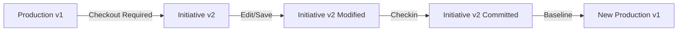

# Version Control Complete Implementation Guide

## 📋 Table of Contents

1. [Overview](#overview)
2. [Current Issues](#current-issues)
3. [Design Principles](#design-principles)
4. [Implementation Architecture](#implementation-architecture)
5. [Visual Indication System](#visual-indication-system)
6. [Checkout Persistence](#checkout-persistence)
7. [Initiative Version Isolation](#initiative-version-isolation)
8. [Implementation Roadmap](#implementation-roadmap)
9. [Testing Strategy](#testing-strategy)

---

## 🎯 Overview

This document consolidates the complete version control system implementation for Architect Studio, addressing all identified issues and providing a comprehensive solution for enterprise-grade artifact management.

### Key Documents Referenced:
- `ARTIFACT_VISUAL_INDICATION_SYSTEM.md` - Visual feedback implementation
- `VERSION_CONTROL_DESIGN_ISSUES_AND_FIXES.md` - Core design corrections
- `CHECKOUT_PERSISTENCE_ENHANCEMENT.md` - Checkout state management
- `INITIATIVE_VERSION_ISOLATION.md` - Production isolation design

---

## ❌ Current Issues

### 1. **Improper Version Control Flow**
- Direct editing without checkout
- Checkout state lost after save
- Production version shown in initiative context
- No proper version isolation

### 2. **Visual Feedback Problems**
- Inconsistent state indicators
- Missing checkout persistence visuals
- No differentiation between edited/checked-in states

### 3. **Data Integrity Risks**
- Production data can be modified directly
- No enforcement of checkout-first workflow
- Version mixing between initiatives and production

---

## ✅ Design Principles

### 1. **Mandatory Checkout-First Workflow**


### 2. **Complete Initiative Isolation**
- Production remains untouched until baseline
- All changes occur in initiative versions
- No mixing of production and initiative data

### 3. **Persistent Checkout State**
- Lock maintained through multiple saves
- Visual indicators persist
- Clear state transitions

### 4. **Rich Visual Feedback**
- Color-coded states
- Icons and badges
- Contextual tooltips

---

## 🏗️ Implementation Architecture

### Database Schema

```sql
-- Enhanced artifact_versions table
CREATE TABLE artifact_versions (
    id SERIAL PRIMARY KEY,
    artifact_type VARCHAR(50) NOT NULL,
    artifact_id INTEGER NOT NULL,
    version INTEGER NOT NULL,
    initiative_id VARCHAR(255),
    artifact_data JSONB NOT NULL,
    changes JSONB DEFAULT '{}',
    change_description TEXT,
    changed_by INTEGER REFERENCES users(id),
    is_baseline BOOLEAN DEFAULT false,
    is_committed BOOLEAN DEFAULT false,
    created_at TIMESTAMP DEFAULT NOW(),
    updated_at TIMESTAMP DEFAULT NOW(),
    baselined_at TIMESTAMP,
    baselined_by INTEGER REFERENCES users(id),
    
    -- Constraints
    CONSTRAINT unique_production_baseline 
        UNIQUE (artifact_type, artifact_id, is_baseline) 
        WHERE is_baseline = true,
    
    CONSTRAINT unique_initiative_version 
        UNIQUE (artifact_type, artifact_id, initiative_id) 
        WHERE initiative_id IS NOT NULL,
        
    CONSTRAINT version_positive CHECK (version > 0)
);

-- Artifact locks table
CREATE TABLE artifact_locks (
    id SERIAL PRIMARY KEY,
    artifact_type VARCHAR(50) NOT NULL,
    artifact_id INTEGER NOT NULL,
    initiative_id VARCHAR(255) NOT NULL,
    locked_by INTEGER REFERENCES users(id),
    lock_expiry TIMESTAMP NOT NULL,
    lock_reason TEXT,
    created_at TIMESTAMP DEFAULT NOW(),
    
    CONSTRAINT unique_artifact_lock 
        UNIQUE (artifact_type, artifact_id, initiative_id)
);

-- Indexes for performance
CREATE INDEX idx_artifact_versions_lookup 
    ON artifact_versions(artifact_type, artifact_id, initiative_id);
CREATE INDEX idx_artifact_locks_active 
    ON artifact_locks(artifact_type, artifact_id, lock_expiry);
```

### Version Control Service

```typescript
// /server/services/version-control.service.ts
export class VersionControlService {
  
  /**
   * Core checkout method - creates initiative version
   */
  static async checkoutArtifact(
    artifactType: ArtifactType,
    artifactId: number,
    initiativeId: string,
    userId: number
  ): Promise<ArtifactVersion> {
    
    return await db.transaction(async (tx) => {
      // 1. Verify no existing lock
      const existingLock = await this.getActiveLock(tx, artifactType, artifactId);
      if (existingLock) {
        throw new Error(`Artifact locked by ${existingLock.user.username}`);
      }
      
      // 2. Get production baseline
      const productionVersion = await this.getProductionVersion(tx, artifactType, artifactId);
      if (!productionVersion) {
        throw new Error("No production baseline found");
      }
      
      // 3. Check for existing initiative version
      const existingInitVersion = await this.getInitiativeVersion(
        tx, artifactType, artifactId, initiativeId
      );
      if (existingInitVersion) {
        throw new Error("Artifact already has version in this initiative");
      }
      
      // 4. Create initiative version (copy from production)
      const [initiativeVersion] = await tx.insert(artifactVersions).values({
        artifactType,
        artifactId,
        version: productionVersion.version + 1,
        initiativeId,
        artifactData: productionVersion.artifactData,
        changes: {},
        changeDescription: `Checked out from production v${productionVersion.version}`,
        changedBy: userId,
        isBaseline: false,
        isCommitted: false
      }).returning();
      
      // 5. Create lock
      await tx.insert(artifactLocks).values({
        artifactType,
        artifactId,
        initiativeId,
        lockedBy: userId,
        lockExpiry: new Date(Date.now() + 24 * 60 * 60 * 1000), // 24 hours
        lockReason: `Checkout for initiative ${initiativeId}`
      });
      
      return initiativeVersion;
    });
  }
  
  /**
   * Save changes - maintains lock
   */
  static async saveArtifactChanges(
    artifactType: ArtifactType,
    artifactId: number,
    initiativeId: string,
    userId: number,
    changes: any
  ): Promise<ArtifactVersion> {
    
    return await db.transaction(async (tx) => {
      // 1. Verify user has lock
      const lock = await this.verifyUserLock(tx, artifactType, artifactId, initiativeId, userId);
      
      // 2. Get initiative version
      const initiativeVersion = await this.getInitiativeVersion(
        tx, artifactType, artifactId, initiativeId
      );
      if (!initiativeVersion) {
        throw new Error("No initiative version found");
      }
      
      // 3. Update initiative version only
      const [updated] = await tx.update(artifactVersions)
        .set({
          artifactData: { ...initiativeVersion.artifactData, ...changes },
          changes: { ...initiativeVersion.changes, ...changes },
          changedBy: userId,
          updatedAt: new Date()
        })
        .where(eq(artifactVersions.id, initiativeVersion.id))
        .returning();
      
      // 4. Extend lock
      await tx.update(artifactLocks)
        .set({
          lockExpiry: new Date(Date.now() + 24 * 60 * 60 * 1000)
        })
        .where(eq(artifactLocks.id, lock.id));
      
      return updated;
    });
  }
  
  /**
   * Checkin - commits version, releases lock
   */
  static async checkinArtifact(
    artifactType: ArtifactType,
    artifactId: number,
    initiativeId: string,
    userId: number,
    changeDescription?: string
  ): Promise<ArtifactVersion> {
    
    return await db.transaction(async (tx) => {
      // 1. Verify user has lock
      const lock = await this.verifyUserLock(tx, artifactType, artifactId, initiativeId, userId);
      
      // 2. Get initiative version
      const initiativeVersion = await this.getInitiativeVersion(
        tx, artifactType, artifactId, initiativeId
      );
      if (!initiativeVersion) {
        throw new Error("No initiative version found");
      }
      
      // 3. Mark as committed
      const [committed] = await tx.update(artifactVersions)
        .set({
          isCommitted: true,
          changeDescription: changeDescription || initiativeVersion.changeDescription,
          updatedAt: new Date()
        })
        .where(eq(artifactVersions.id, initiativeVersion.id))
        .returning();
      
      // 4. Remove lock
      await tx.delete(artifactLocks)
        .where(eq(artifactLocks.id, lock.id));
      
      return committed;
    });
  }
  
  /**
   * Cancel checkout - removes version and lock
   */
  static async cancelCheckout(
    artifactType: ArtifactType,
    artifactId: number,
    initiativeId: string,
    userId: number
  ): Promise<void> {
    
    await db.transaction(async (tx) => {
      // 1. Verify user has lock (or is admin)
      const lock = await this.verifyUserLock(tx, artifactType, artifactId, initiativeId, userId);
      
      // 2. Delete initiative version
      await tx.delete(artifactVersions)
        .where(
          and(
            eq(artifactVersions.artifactType, artifactType),
            eq(artifactVersions.artifactId, artifactId),
            eq(artifactVersions.initiativeId, initiativeId),
            eq(artifactVersions.isBaseline, false)
          )
        );
      
      // 3. Remove lock
      await tx.delete(artifactLocks)
        .where(eq(artifactLocks.id, lock.id));
    });
  }
  
  /**
   * Get contextual version based on initiative
   */
  static async getContextualVersion(
    artifactType: ArtifactType,
    artifactId: number,
    initiativeId: string | null,
    includeMetadata: boolean = true
  ): Promise<any> {
    
    // Initiative context - return initiative version
    if (initiativeId) {
      const initiativeVersion = await this.getInitiativeVersion(
        db, artifactType, artifactId, initiativeId
      );
      
      if (initiativeVersion) {
        const lock = await this.getActiveLock(db, artifactType, artifactId);
        
        return {
          ...initiativeVersion.artifactData,
          ...(includeMetadata && {
            _metadata: {
              version: initiativeVersion.version,
              initiativeId: initiativeVersion.initiativeId,
              isCommitted: initiativeVersion.isCommitted,
              isBaseline: false,
              isCheckedOut: !!lock,
              lockedBy: lock?.lockedBy,
              hasChanges: Object.keys(initiativeVersion.changes || {}).length > 0,
              source: 'initiative'
            }
          })
        };
      }
    }
    
    // Production context - return baseline
    const productionVersion = await this.getProductionVersion(
      db, artifactType, artifactId
    );
    
    if (productionVersion) {
      return {
        ...productionVersion.artifactData,
        ...(includeMetadata && {
          _metadata: {
            version: productionVersion.version,
            isBaseline: true,
            source: 'production'
          }
        })
      };
    }
    
    return null;
  }
  
  /**
   * Baseline initiative - make all committed versions production
   */
  static async baselineInitiative(
    initiativeId: string,
    userId: number
  ): Promise<BaselineResult> {
    
    return await db.transaction(async (tx) => {
      // 1. Get all committed versions
      const committedVersions = await tx.select()
        .from(artifactVersions)
        .where(
          and(
            eq(artifactVersions.initiativeId, initiativeId),
            eq(artifactVersions.isCommitted, true)
          )
        );
      
      const results = {
        baselined: 0,
        errors: []
      };
      
      // 2. Process each version
      for (const version of committedVersions) {
        try {
          // Archive current production
          await tx.update(artifactVersions)
            .set({
              isBaseline: false,
              archivedAt: new Date()
            })
            .where(
              and(
                eq(artifactVersions.artifactType, version.artifactType),
                eq(artifactVersions.artifactId, version.artifactId),
                eq(artifactVersions.isBaseline, true)
              )
            );
          
          // Make initiative version the new baseline
          await tx.update(artifactVersions)
            .set({
              isBaseline: true,
              baselinedAt: new Date(),
              baselinedBy: userId
            })
            .where(eq(artifactVersions.id, version.id));
          
          results.baselined++;
        } catch (error) {
          results.errors.push({
            artifactType: version.artifactType,
            artifactId: version.artifactId,
            error: error.message
          });
        }
      }
      
      // 3. Remove all locks for this initiative
      await tx.delete(artifactLocks)
        .where(eq(artifactLocks.initiativeId, initiativeId));
      
      return results;
    });
  }
}
```

---

## 🎨 Visual Indication System

### State Definitions

```typescript
// /client/src/lib/artifact-state-utils.ts
export interface ArtifactState {
  isCheckedOut: boolean;
  isCheckedOutByMe: boolean;
  isLockedByOther: boolean;
  hasInitiativeChanges: boolean;
  hasUncommittedChanges: boolean;
  isCheckedIn: boolean;
  hasConflicts: boolean;
  isProductionBaseline: boolean;
  lockedBy?: string;
  state: 'production' | 'checked_out_clean' | 'checked_out_edited' | 
        'checked_in' | 'locked_other' | 'conflicted';
}
```

### Visual Mapping

| State | Color | Icon | Description |
|-------|-------|------|-------------|
| **Production** | 🟢 Green (default) | - | Baseline version |
| **Checked Out (Clean)** | 🟡 Yellow | 🔒 Lock | No edits yet |
| **Checked Out (Edited)** | 🟠 Orange | 📝 Edit | Has saved changes |
| **Checked In** | 🔵 Blue | ✅ Check | Committed to initiative |
| **Locked by Other** | 🔴 Red | 🚫 Block | Cannot edit |
| **Conflicted** | 🟣 Purple | ⚠️ Warning | Needs resolution |

### Implementation

```typescript
export function getArtifactVisuals(state: ArtifactState): ArtifactVisuals {
  switch (state.state) {
    case 'checked_out_clean':
      return {
        rowClassName: 'bg-yellow-950/30 border-l-4 border-yellow-500',
        iconComponent: Lock,
        iconColor: 'text-yellow-400',
        badgeText: 'CHECKED OUT',
        badgeColor: 'bg-yellow-900 text-yellow-200',
        tooltip: 'Checked out - ready for editing',
        statusText: 'Checked Out',
        statusColor: 'bg-yellow-600'
      };

    case 'checked_out_edited':
      return {
        rowClassName: 'bg-orange-950/30 border-l-4 border-orange-500',
        iconComponent: Edit,
        iconColor: 'text-orange-400',
        badgeText: 'EDITED',
        badgeColor: 'bg-orange-900 text-orange-200',
        tooltip: 'Has saved changes - ready for checkin',
        statusText: 'Edited',
        statusColor: 'bg-orange-600'
      };

    case 'checked_in':
      return {
        rowClassName: 'bg-blue-950/30 border-l-4 border-blue-500',
        iconComponent: CheckCircle,
        iconColor: 'text-blue-400',
        badgeText: 'CHECKED IN',
        badgeColor: 'bg-blue-900 text-blue-200',
        tooltip: 'Committed to initiative - awaiting baseline',
        statusText: 'Checked In',
        statusColor: 'bg-blue-600'
      };
    
    // ... other states
  }
}
```

---

## 🔒 Checkout Persistence

### Backend Implementation

```typescript
// Route handler maintains lock on save
router.put("/applications/:id", requireAuth, async (req, res) => {
  const { id } = req.params;
  const { initiativeId, ...changes } = req.body;
  
  if (initiativeId) {
    // Check for checkout requirement
    const lock = await VersionControlService.getActiveLock(
      'application', parseInt(id)
    );
    
    if (!lock || lock.lockedBy !== req.user!.id) {
      return res.status(403).json({
        error: "Artifact must be checked out before editing",
        code: "CHECKOUT_REQUIRED"
      });
    }
    
    // Save to initiative version (maintains lock)
    const version = await VersionControlService.saveArtifactChanges(
      'application',
      parseInt(id),
      initiativeId,
      req.user!.id,
      changes
    );
    
    return res.json({
      success: true,
      message: "Changes saved. Checkout maintained.",
      version: version.version,
      checkoutStatus: "checked_out_edited"
    });
  }
  
  // Production save logic...
});
```

### Frontend State Management

```typescript
// Form component tracks checkout state
const ApplicationForm = ({ applicationId, onSuccess }) => {
  const { currentInitiative, isProductionView } = useInitiative();
  const [checkoutState, setCheckoutState] = useState<CheckoutState>('none');
  const [formData, setFormData] = useState({});
  
  // Fetch with version metadata
  useEffect(() => {
    if (applicationId && currentInitiative && !isProductionView) {
      fetchApplicationWithState();
    }
  }, [applicationId, currentInitiative]);
  
  const fetchApplicationWithState = async () => {
    const response = await api.get(`/api/applications/${applicationId}`, {
      params: { initiativeId: currentInitiative?.initiativeId }
    });
    
    const { _metadata, ...data } = response.data;
    setFormData(data);
    
    // Set checkout state based on metadata
    if (_metadata?.isCheckedOut && _metadata?.hasChanges) {
      setCheckoutState('checked_out_edited');
    } else if (_metadata?.isCheckedOut) {
      setCheckoutState('checked_out_clean');
    } else if (_metadata?.isCommitted) {
      setCheckoutState('checked_in');
    }
  };
  
  const handleSave = async () => {
    // Require checkout for initiative edits
    if (currentInitiative && !isProductionView && checkoutState === 'none') {
      toast({
        title: "Checkout Required",
        description: "Please checkout the artifact before making changes",
        variant: "destructive"
      });
      return;
    }
    
    const response = await api.put(`/api/applications/${applicationId}`, {
      ...formData,
      initiativeId: currentInitiative?.initiativeId
    });
    
    // Update state after save
    if (response.data.checkoutStatus) {
      setCheckoutState(response.data.checkoutStatus);
    }
    
    toast({
      title: "Success",
      description: response.data.message
    });
  };
  
  // Render checkout status
  const renderCheckoutStatus = () => {
    const visuals = getCheckoutStateVisuals(checkoutState);
    if (!visuals) return null;
    
    return (
      <div className={`rounded p-3 ${visuals.bgColor} ${visuals.borderColor}`}>
        <div className="flex items-center space-x-2">
          <visuals.icon className={`h-4 w-4 ${visuals.iconColor}`} />
          <span className={visuals.textColor}>{visuals.message}</span>
        </div>
      </div>
    );
  };
  
  return (
    <form onSubmit={handleSave}>
      {renderCheckoutStatus()}
      {/* Form fields... */}
    </form>
  );
};
```

---

## 🔐 Initiative Version Isolation

### Core Principle

**Production remains completely untouched until initiative baseline.**

### Version Flow

```
Production v1 → Checkout → Initiative v2 (Draft)
                    ↓
                Edit/Save → Initiative v2 (Modified)
                    ↓
                 Checkin → Initiative v2 (Committed)
                    ↓
            Initiative Complete → v2 becomes new Production v1
```

### Context-Aware Data Access

```typescript
// API endpoint respects context
router.get("/applications/:id", async (req, res) => {
  const { id } = req.params;
  const { initiativeId } = req.query;
  
  // Get appropriate version based on context
  const data = await VersionControlService.getContextualVersion(
    'application',
    parseInt(id),
    initiativeId as string || null
  );
  
  res.json(data);
});

// Frontend respects view mode
const useApplicationData = (applicationId: number) => {
  const { currentInitiative, isProductionView } = useInitiative();
  
  return useQuery({
    queryKey: ['application', applicationId, currentInitiative?.initiativeId, isProductionView],
    queryFn: async () => {
      const response = await api.get(`/api/applications/${applicationId}`, {
        params: {
          // Only send initiativeId if in initiative view
          initiativeId: !isProductionView ? currentInitiative?.initiativeId : null
        }
      });
      return response.data;
    }
  });
};
```

---

## 📋 Implementation Roadmap

### Phase 1: Backend Core (Week 1)
- [ ] Implement VersionControlService
- [ ] Update all artifact routes
- [ ] Add database constraints
- [ ] Create migration scripts

### Phase 2: Frontend State Management (Week 2)
- [ ] Update artifact forms with checkout UI
- [ ] Implement visual state indicators
- [ ] Add version metadata display
- [ ] Update list pages with new visuals

### Phase 3: Initiative Management (Week 3)
- [ ] Enhanced initiative closure dialog
- [ ] Baseline process implementation
- [ ] Conflict detection and resolution
- [ ] Admin override capabilities

### Phase 4: Testing & Polish (Week 4)
- [ ] Comprehensive testing suite
- [ ] Performance optimization
- [ ] Documentation updates
- [ ] User training materials

---

## 🧪 Testing Strategy

### Unit Tests

```typescript
describe('VersionControlService', () => {
  it('should create initiative version on checkout', async () => {
    const version = await VersionControlService.checkoutArtifact(
      'application', 1, 'INIT-001', userId
    );
    
    expect(version.version).toBe(2);
    expect(version.initiativeId).toBe('INIT-001');
    expect(version.isBaseline).toBe(false);
  });
  
  it('should maintain lock on save', async () => {
    await VersionControlService.checkoutArtifact(...);
    await VersionControlService.saveArtifactChanges(...);
    
    const lock = await VersionControlService.getActiveLock(...);
    expect(lock).toBeDefined();
  });
  
  it('should isolate initiative from production', async () => {
    const prodVersion = await VersionControlService.getContextualVersion(
      'application', 1, null
    );
    
    await VersionControlService.checkoutArtifact(...);
    await VersionControlService.saveArtifactChanges(...);
    
    const prodVersionAfter = await VersionControlService.getContextualVersion(
      'application', 1, null
    );
    
    expect(prodVersion).toEqual(prodVersionAfter);
  });
});
```

### Integration Tests

```typescript
describe('Version Control Workflow', () => {
  it('should complete full checkout-edit-checkin cycle', async () => {
    // 1. Checkout
    const checkoutRes = await request(app)
      .post('/api/version-control/checkout')
      .send({ artifactType: 'application', artifactId: 1, initiativeId: 'INIT-001' });
    
    expect(checkoutRes.status).toBe(200);
    
    // 2. Edit
    const editRes = await request(app)
      .put('/api/applications/1')
      .send({ initiativeId: 'INIT-001', name: 'Updated App' });
    
    expect(editRes.body.checkoutStatus).toBe('checked_out_edited');
    
    // 3. Verify production unchanged
    const prodRes = await request(app)
      .get('/api/applications/1');
    
    expect(prodRes.body.name).not.toBe('Updated App');
    
    // 4. Checkin
    const checkinRes = await request(app)
      .post('/api/version-control/checkin')
      .send({ artifactType: 'application', artifactId: 1, initiativeId: 'INIT-001' });
    
    expect(checkinRes.status).toBe(200);
  });
});
```

### E2E Tests

```typescript
describe('Visual State Indicators', () => {
  it('should show correct colors for each state', async () => {
    // Navigate to applications page
    await page.goto('/applications');
    
    // Checkout an application
    await page.click('[data-testid="checkout-app-1"]');
    
    // Verify yellow indicator
    const row = await page.$('[data-testid="app-row-1"]');
    const classes = await row.getAttribute('class');
    expect(classes).toContain('border-yellow-500');
    
    // Edit and save
    await page.click('[data-testid="edit-app-1"]');
    await page.fill('[name="name"]', 'Updated Name');
    await page.click('[data-testid="save-button"]');
    
    // Verify orange indicator
    const updatedClasses = await row.getAttribute('class');
    expect(updatedClasses).toContain('border-orange-500');
  });
});
```

---

## 📚 API Reference

### Version Control Endpoints

```typescript
// Checkout artifact
POST /api/version-control/checkout
Body: {
  artifactType: 'application' | 'interface' | 'business_process' | 'internal_process' | 'technical_process',
  artifactId: number,
  initiativeId: string
}

// Checkin artifact
POST /api/version-control/checkin
Body: {
  artifactType: string,
  artifactId: number,
  initiativeId: string,
  changeDescription?: string
}

// Cancel checkout
POST /api/version-control/cancel-checkout
Body: {
  artifactType: string,
  artifactId: number,
  initiativeId: string
}

// Get artifact with version context
GET /api/{artifactType}s/{id}?initiativeId={initiativeId}

// Update artifact (respects checkout)
PUT /api/{artifactType}s/{id}
Body: {
  initiativeId?: string,
  ...artifactData
}
```

---

## 🎯 Summary

This complete implementation guide provides:

1. **✅ Proper version control workflow** - Checkout-first with persistence
2. **✅ Complete production isolation** - Initiative changes never affect production
3. **✅ Rich visual feedback** - Clear state indicators throughout
4. **✅ Data integrity** - Transactions and constraints ensure consistency
5. **✅ Enterprise scalability** - Supports concurrent users and initiatives

The system ensures that production data remains stable while allowing safe, tracked changes within initiatives, with clear visual feedback at every step of the process.