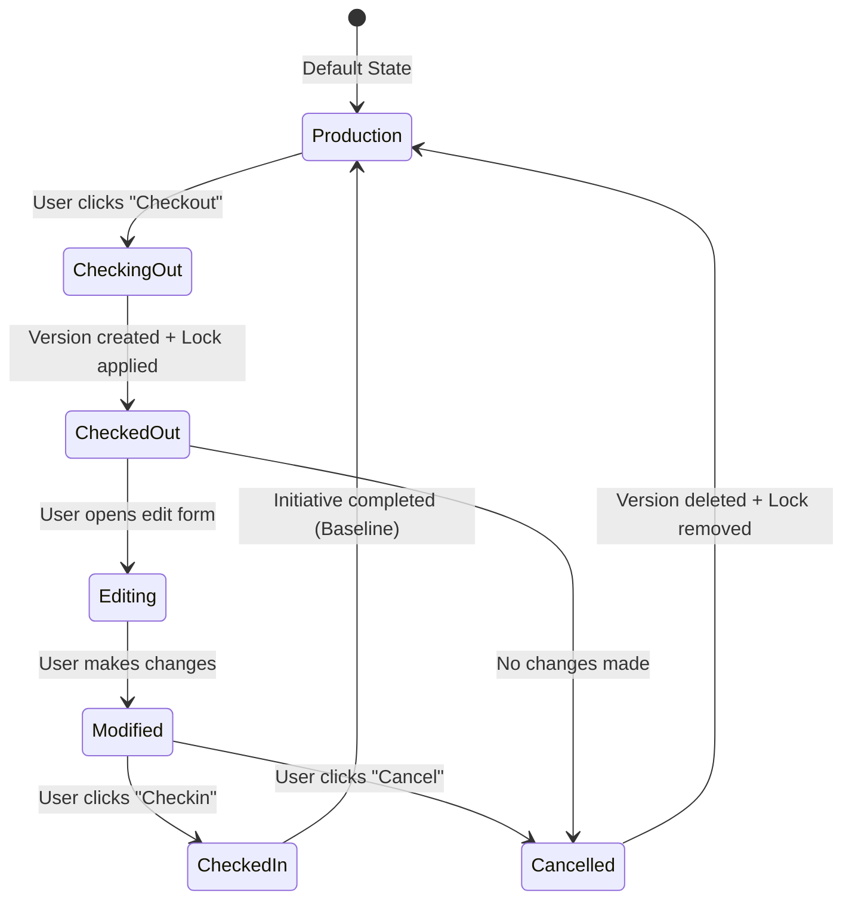

# Version Control Design Issues and Corrective Implementation

## 🚨 Critical Design Issues Identified

The current version control implementation has fundamental flaws that compromise data integrity and proper version management. This document outlines the issues and provides a comprehensive solution.

---

## ❌ Current Issues

### 1. **Direct Editing Without Checkout**
**Problem**: Users can edit artifacts directly without checking them out from production.
**Risk**: 
- Data integrity issues
- Concurrent modification conflicts
- Loss of version history
- Bypassing proper change tracking

### 2. **Improper Version Management**
**Problem**: Changes are not properly versioned during the edit process.
**Risk**:
- No proper audit trail
- Cannot track incremental changes
- Difficulty in rollback scenarios

### 3. **Incorrect Baseline Process**
**Problem**: Initiative completion doesn't properly baseline artifacts.
**Risk**:
- Version drift
- Inconsistent production state
- Loss of change history

### 4. **Missing Enforcement Mechanisms**
**Problem**: No UI/backend enforcement of checkout-first workflow.
**Risk**:
- User confusion
- Workflow violations
- Data consistency issues

---

## ✅ Corrected Version Control Design

### **Core Principles**

1. **📋 Mandatory Checkout**: No artifact can be edited without explicit checkout from production
2. **🏷️ Version Creation**: Every checkout creates a new version tagged to the initiative
3. **🗑️ Clean Cancellation**: Cancel checkout deletes the new version and removes locks
4. **✅ Proper Checkin**: Checkin updates the version with changes and maintains locks
5. **🎯 Baseline on Completion**: Initiative completion baselines all versions as new production

---

## 🏗️ Implementation Plan

### Phase 1: Backend Enforcement

#### 1.1 Update Version Control Service

**File**: `/server/services/version-control.service.ts`

```typescript
export class VersionControlService {
  
  /**
   * Enhanced checkout that ALWAYS creates a new version
   */
  static async checkoutArtifact(
    artifactType: ArtifactType,
    artifactId: number,
    initiativeId: string,
    userId: number
  ): Promise<ArtifactVersion> {
    
    // 1. Verify no existing lock
    const existingLock = await this.checkExistingLock(artifactType, artifactId);
    if (existingLock) {
      throw new Error(`Artifact already checked out by ${existingLock.user.username}`);
    }
    
    // 2. Get current production baseline
    const productionVersion = await this.getProductionBaseline(artifactType, artifactId);
    if (!productionVersion) {
      throw new Error("No production baseline found for artifact");
    }
    
    // 3. Create new version for initiative (non-baseline)
    const newVersion = await db.insert(artifactVersions).values({
      artifactType,
      artifactId,
      initiativeId,
      version: productionVersion.version + 1, // Increment version
      artifactData: productionVersion.artifactData, // Copy from production
      changes: {},
      changeDescription: `Checked out for initiative: ${initiativeId}`,
      changedBy: userId,
      isBaseline: false, // Critical: NOT a baseline
      createdAt: new Date(),
      updatedAt: new Date()
    }).returning();
    
    // 4. Create lock
    await this.createLock(artifactType, artifactId, initiativeId, userId);
    
    return newVersion[0];
  }
  
  /**
   * Enhanced checkin that updates existing initiative version
   */
  static async checkinArtifact(
    artifactType: ArtifactType,
    artifactId: number,
    initiativeId: string,
    userId: number,
    changes: any,
    changeDescription: string
  ): Promise<ArtifactVersion> {
    
    // 1. Verify user has lock
    const lock = await this.verifyUserLock(artifactType, artifactId, initiativeId, userId);
    
    // 2. Get existing initiative version (non-baseline)
    const initiativeVersion = await db.select()
      .from(artifactVersions)
      .where(
        and(
          eq(artifactVersions.artifactType, artifactType),
          eq(artifactVersions.artifactId, artifactId),
          eq(artifactVersions.initiativeId, initiativeId),
          eq(artifactVersions.isBaseline, false)
        )
      )
      .limit(1);
    
    if (!initiativeVersion.length) {
      throw new Error("No initiative version found. Must checkout first.");
    }
    
    // 3. Update the initiative version with changes
    const updatedVersion = await db.update(artifactVersions)
      .set({
        artifactData: { ...initiativeVersion[0].artifactData, ...changes },
        changes: changes,
        changeDescription: changeDescription,
        changedBy: userId,
        updatedAt: new Date()
      })
      .where(eq(artifactVersions.id, initiativeVersion[0].id))
      .returning();
    
    // Keep lock - don't remove until explicit checkin completion
    
    return updatedVersion[0];
  }
  
  /**
   * Enhanced cancel checkout that deletes initiative version
   */
  static async cancelCheckout(
    artifactType: ArtifactType,
    artifactId: number,
    initiativeId: string,
    userId: number
  ): Promise<void> {
    
    // 1. Verify user has lock
    await this.verifyUserLock(artifactType, artifactId, initiativeId, userId);
    
    // 2. Delete initiative version (non-baseline)
    await db.delete(artifactVersions)
      .where(
        and(
          eq(artifactVersions.artifactType, artifactType),
          eq(artifactVersions.artifactId, artifactId),
          eq(artifactVersions.initiativeId, initiativeId),
          eq(artifactVersions.isBaseline, false)
        )
      );
    
    // 3. Remove lock
    await this.removeLock(artifactType, artifactId, initiativeId, userId);
  }
  
  /**
   * Baseline all initiative versions on completion
   */
  static async baselineInitiative(initiativeId: string): Promise<void> {
    
    // 1. Get all non-baseline versions for initiative
    const initiativeVersions = await db.select()
      .from(artifactVersions)
      .where(
        and(
          eq(artifactVersions.initiativeId, initiativeId),
          eq(artifactVersions.isBaseline, false)
        )
      );
    
    // 2. Mark current production baselines as archived
    for (const version of initiativeVersions) {
      await db.update(artifactVersions)
        .set({ isBaseline: false, archivedAt: new Date() })
        .where(
          and(
            eq(artifactVersions.artifactType, version.artifactType),
            eq(artifactVersions.artifactId, version.artifactId),
            eq(artifactVersions.isBaseline, true)
          )
        );
    }
    
    // 3. Mark initiative versions as new baselines
    await db.update(artifactVersions)
      .set({ 
        isBaseline: true,
        baselinedAt: new Date(),
        baselinedBy: userId // From initiative completion
      })
      .where(
        and(
          eq(artifactVersions.initiativeId, initiativeId),
          eq(artifactVersions.isBaseline, false)
        )
      );
    
    // 4. Remove all locks for this initiative
    await db.delete(artifactLocks)
      .where(eq(artifactLocks.initiativeId, initiativeId));
  }
}
```

#### 1.2 Update Route Handlers

**File**: `/server/routes/version-control.ts`

```typescript
// Enhanced checkout endpoint
versionControlRouter.post("/checkout", requireAuth, async (req, res) => {
  try {
    const userId = req.user!.id;
    const { artifactType, artifactId, initiativeId } = checkoutSchema.parse(req.body);

    // Verify user is participant
    await verifyInitiativeParticipant(initiativeId, userId);
    
    // Perform checkout (creates new version)
    const version = await VersionControlService.checkoutArtifact(
      artifactType as ArtifactType,
      artifactId,
      initiativeId,
      userId
    );

    res.json({ 
      success: true,
      message: "Artifact checked out successfully. New version created.",
      version: version,
      workflow: {
        step: "checked_out",
        nextActions: ["edit", "checkin", "cancel"]
      }
    });
  } catch (error) {
    console.error("Checkout error:", error);
    res.status(500).json({ 
      error: error.message || "Failed to checkout artifact",
      workflow: {
        step: "error",
        nextActions: ["retry"]
      }
    });
  }
});

// Enforce checkout-first editing
versionControlRouter.post("/edit", requireAuth, async (req, res) => {
  try {
    const userId = req.user!.id;
    const { artifactType, artifactId, initiativeId } = req.body;

    // Verify artifact is checked out by user
    const lock = await VersionControlService.verifyUserLock(
      artifactType, artifactId, initiativeId, userId
    );
    
    if (!lock) {
      return res.status(403).json({
        error: "Artifact must be checked out before editing",
        workflow: {
          step: "checkout_required",
          nextActions: ["checkout"]
        }
      });
    }

    // Return initiative version for editing
    const version = await VersionControlService.getInitiativeVersion(
      artifactType, artifactId, initiativeId
    );

    res.json({
      success: true,
      version: version,
      workflow: {
        step: "editing",
        nextActions: ["save", "checkin", "cancel"]
      }
    });
  } catch (error) {
    res.status(500).json({ error: error.message });
  }
});
```

### Phase 2: Frontend Enforcement

#### 2.1 Update Artifact Forms

**Files**: All artifact form components

```typescript
// Example: ApplicationForm.tsx
export default function ApplicationForm({ 
  initialData, 
  isEditing, 
  onSuccess 
}: ApplicationFormProps) {
  
  const { currentInitiative, isProductionView } = useInitiative();
  const [isCheckedOut, setIsCheckedOut] = useState(false);
  const [checkoutStatus, setCheckoutStatus] = useState<'none' | 'checking' | 'checked_out' | 'error'>('none');
  
  // Check if artifact is checked out on mount
  useEffect(() => {
    if (isEditing && currentInitiative && !isProductionView) {
      checkArtifactStatus();
    }
  }, [isEditing, currentInitiative]);
  
  const checkArtifactStatus = async () => {
    try {
      const response = await api.get(`/api/version-control/status`, {
        params: {
          artifactType: 'application',
          artifactId: initialData?.id,
          initiativeId: currentInitiative.initiativeId
        }
      });
      
      setIsCheckedOut(response.data.isCheckedOut);
      setCheckoutStatus(response.data.isCheckedOut ? 'checked_out' : 'none');
    } catch (error) {
      setCheckoutStatus('error');
    }
  };
  
  const handleCheckout = async () => {
    if (!currentInitiative || isProductionView) return;
    
    setCheckoutStatus('checking');
    try {
      await api.post('/api/version-control/checkout', {
        artifactType: 'application',
        artifactId: initialData?.id,
        initiativeId: currentInitiative.initiativeId
      });
      
      setIsCheckedOut(true);
      setCheckoutStatus('checked_out');
      toast({
        title: "Checkout Successful",
        description: "Artifact is now locked for editing. A new version has been created."
      });
    } catch (error) {
      setCheckoutStatus('error');
      toast({
        title: "Checkout Failed",
        description: error.response?.data?.error || "Failed to checkout artifact",
        variant: "destructive"
      });
    }
  };
  
  const handleSave = async (formData: any) => {
    // In initiative mode, require checkout
    if (currentInitiative && !isProductionView && !isCheckedOut) {
      toast({
        title: "Checkout Required",
        description: "You must checkout the artifact before making changes",
        variant: "destructive"
      });
      return;
    }
    
    // Save logic here...
  };
  
  // Render checkout UI if needed
  if (isEditing && currentInitiative && !isProductionView && !isCheckedOut) {
    return (
      <div className="space-y-6">
        <div className="bg-amber-900/20 border border-amber-700 rounded-lg p-4">
          <div className="flex items-center space-x-3">
            <AlertTriangle className="h-5 w-5 text-amber-400" />
            <div>
              <h3 className="text-sm font-medium text-amber-200">Checkout Required</h3>
              <p className="text-sm text-amber-300 mt-1">
                This artifact must be checked out before editing. This will create a new version for your initiative.
              </p>
            </div>
          </div>
          <div className="mt-4">
            <Button 
              onClick={handleCheckout}
              disabled={checkoutStatus === 'checking'}
              className="bg-amber-600 hover:bg-amber-700"
            >
              {checkoutStatus === 'checking' ? (
                <>
                  <Loader2 className="mr-2 h-4 w-4 animate-spin" />
                  Checking Out...
                </>
              ) : (
                <>
                  <GitBranch className="mr-2 h-4 w-4" />
                  Checkout for Editing
                </>
              )}
            </Button>
          </div>
        </div>
      </div>
    );
  }
  
  // Regular form render...
}
```

#### 2.2 Update Context Menus

**Files**: All artifact list pages

```typescript
// Enhanced context menu with proper workflow
{currentInitiative && !isProductionView && (
  <>
    {(() => {
      const lock = isArtifactLocked(artifact.id);
      const isLockedByMe = lock?.lock.lockedBy === currentUser?.id;
      const isLockedByOther = lock && !isLockedByMe;
      
      return (
        <>
          {/* Checkout option - only if not locked */}
          {!lock && (
            <ContextMenuItem 
              onClick={() => handleCheckout(artifact)}
              className="text-blue-400 hover:bg-blue-900/20"
            >
              <GitBranch className="mr-2 h-4 w-4" />
              Checkout for Editing
            </ContextMenuItem>
          )}
          
          {/* Edit option - only if checked out by me */}
          {isLockedByMe && (
            <ContextMenuItem 
              onClick={() => handleEdit(artifact)}
              className="text-green-400 hover:bg-green-900/20"
            >
              <Edit className="mr-2 h-4 w-4" />
              Edit (Checked Out)
            </ContextMenuItem>
          )}
          
          {/* Checkin option - only if checked out by me */}
          {isLockedByMe && (
            <ContextMenuItem 
              onClick={() => handleCheckin(artifact)}
              className="text-purple-400 hover:bg-purple-900/20"
            >
              <Unlock className="mr-2 h-4 w-4" />
              Checkin Changes
            </ContextMenuItem>
          )}
          
          {/* Cancel checkout - only if checked out by me */}
          {isLockedByMe && (
            <ContextMenuItem 
              onClick={() => handleCancelCheckout(artifact)}
              className="text-red-400 hover:bg-red-900/20"
            >
              <X className="mr-2 h-4 w-4" />
              Cancel Checkout (Discard Changes)
            </ContextMenuItem>
          )}
          
          {/* Locked indicator - if locked by other */}
          {isLockedByOther && (
            <ContextMenuItem 
              disabled
              className="text-gray-500"
            >
              <Lock className="mr-2 h-4 w-4" />
              Locked by {lock.user?.username}
            </ContextMenuItem>
          )}
        </>
      );
    })()}
    <ContextMenuSeparator className="bg-gray-700" />
  </>
)}

{/* Production mode options */}
{(isProductionView || !currentInitiative) && (
  <ContextMenuItem 
    onClick={() => handleDirectEdit(artifact)}
    className="text-gray-300 hover:bg-gray-700"
  >
    <Edit className="mr-2 h-4 w-4" />
    Edit (Production)
  </ContextMenuItem>
)}
```

### Phase 3: Initiative Completion

#### 3.1 Enhanced Initiative Closure

**File**: `/components/initiatives/initiative-closure-dialog.tsx`

```typescript
export function InitiativeClosureDialog({ 
  initiative, 
  onClose 
}: InitiativeClosureDialogProps) {
  
  const [step, setStep] = useState<'review' | 'checkin' | 'baseline' | 'complete'>('review');
  const [checkedOutArtifacts, setCheckedOutArtifacts] = useState<any[]>([]);
  
  // Step 1: Review all checked out artifacts
  const reviewCheckedOutArtifacts = async () => {
    const response = await api.get(`/api/version-control/initiative-status/${initiative.initiativeId}`);
    setCheckedOutArtifacts(response.data.checkedOutArtifacts);
  };
  
  // Step 2: Force checkin all artifacts
  const forceCheckinAll = async () => {
    for (const artifact of checkedOutArtifacts) {
      try {
        await api.post('/api/version-control/admin/force-checkin', {
          artifactType: artifact.artifactType,
          artifactId: artifact.artifactId,
          initiativeId: initiative.initiativeId,
          changes: artifact.currentChanges,
          changeDescription: `Auto-checkin during initiative closure: ${initiative.name}`
        });
      } catch (error) {
        console.error(`Failed to checkin ${artifact.artifactType}:${artifact.artifactId}`, error);
      }
    }
    setStep('baseline');
  };
  
  // Step 3: Baseline all initiative versions
  const baselineAllVersions = async () => {
    try {
      await api.post('/api/version-control/baseline-initiative', {
        initiativeId: initiative.initiativeId
      });
      setStep('complete');
    } catch (error) {
      console.error('Failed to baseline initiative', error);
    }
  };
  
  return (
    <Dialog open={true} onOpenChange={onClose}>
      <DialogContent className="max-w-4xl max-h-[80vh] overflow-y-auto">
        <DialogHeader>
          <DialogTitle>Complete Initiative: {initiative.name}</DialogTitle>
        </DialogHeader>
        
        {step === 'review' && (
          <div className="space-y-4">
            <div className="bg-blue-900/20 border border-blue-700 rounded p-4">
              <h3 className="font-medium text-blue-200 mb-2">Initiative Completion Process</h3>
              <ol className="text-sm text-blue-300 space-y-1 list-decimal list-inside">
                <li>Review all checked out artifacts</li>
                <li>Force checkin any uncommitted changes</li>
                <li>Baseline all initiative versions as new production</li>
                <li>Complete initiative and remove all locks</li>
              </ol>
            </div>
            
            <div className="space-y-3">
              <h4 className="font-medium text-white">Checked Out Artifacts</h4>
              {checkedOutArtifacts.length === 0 ? (
                <p className="text-gray-400">No artifacts currently checked out.</p>
              ) : (
                <div className="space-y-2">
                  {checkedOutArtifacts.map((artifact) => (
                    <div key={`${artifact.artifactType}-${artifact.artifactId}`} 
                         className="bg-gray-800 p-3 rounded border border-gray-700">
                      <div className="flex justify-between items-center">
                        <div>
                          <span className="text-white font-medium">{artifact.name}</span>
                          <span className="text-gray-400 ml-2">({artifact.artifactType})</span>
                        </div>
                        <div className="text-sm text-gray-400">
                          Checked out by: {artifact.lockedBy}
                        </div>
                      </div>
                      {artifact.hasChanges && (
                        <div className="mt-2 text-sm text-amber-400">
                          ⚠️ Has uncommitted changes
                        </div>
                      )}
                    </div>
                  ))}
                </div>
              )}
            </div>
            
            <div className="flex justify-end space-x-3">
              <Button variant="outline" onClick={onClose}>Cancel</Button>
              <Button onClick={() => setStep('checkin')} className="bg-blue-600 hover:bg-blue-700">
                Proceed to Checkin
              </Button>
            </div>
          </div>
        )}
        
        {step === 'checkin' && (
          <div className="space-y-4">
            <h3 className="text-lg font-medium text-white">Step 2: Force Checkin All Artifacts</h3>
            <div className="bg-amber-900/20 border border-amber-700 rounded p-4">
              <p className="text-amber-200">
                This will force checkin all checked out artifacts with their current changes.
                Any uncommitted work will be saved as part of the initiative.
              </p>
            </div>
            <div className="flex justify-end space-x-3">
              <Button variant="outline" onClick={() => setStep('review')}>Back</Button>
              <Button onClick={forceCheckinAll} className="bg-amber-600 hover:bg-amber-700">
                Force Checkin All
              </Button>
            </div>
          </div>
        )}
        
        {step === 'baseline' && (
          <div className="space-y-4">
            <h3 className="text-lg font-medium text-white">Step 3: Baseline Initiative Versions</h3>
            <div className="bg-green-900/20 border border-green-700 rounded p-4">
              <p className="text-green-200">
                This will mark all initiative versions as the new production baseline.
                Previous production versions will be archived for history.
              </p>
            </div>
            <div className="flex justify-end space-x-3">
              <Button variant="outline" onClick={() => setStep('checkin')}>Back</Button>
              <Button onClick={baselineAllVersions} className="bg-green-600 hover:bg-green-700">
                Baseline All Versions
              </Button>
            </div>
          </div>
        )}
        
        {step === 'complete' && (
          <div className="space-y-4 text-center">
            <div className="text-green-400 text-6xl">✓</div>
            <h3 className="text-xl font-medium text-white">Initiative Completed Successfully!</h3>
            <p className="text-gray-300">
              All artifacts have been baselined as the new production versions.
            </p>
            <Button onClick={onClose} className="bg-green-600 hover:bg-green-700">
              Close
            </Button>
          </div>
        )}
      </DialogContent>
    </Dialog>
  );
}
```

---

## 🔄 Corrected Workflow

### **User Journey: Editing an Artifact**

1. **🏁 Start**: User wants to edit an artifact in initiative mode
2. **🔍 Check Status**: System shows artifact is in production (locked for editing)
3. **📋 Checkout Required**: User clicks "Checkout for Editing"
4. **🆕 Version Created**: System creates new version tagged to initiative
5. **🔒 Lock Applied**: Artifact is locked to prevent conflicts
6. **✏️ Edit Enabled**: User can now edit the artifact
7. **💾 Save Changes**: Changes are saved to the initiative version
8. **Choice Point**:
   - **✅ Checkin**: Update version with final changes, keep lock
   - **❌ Cancel**: Delete initiative version, remove lock
9. **🎯 Initiative Completion**: All versions are baselined as new production

### **System States**



---

## 🛡️ Data Integrity Safeguards

### **Database Constraints**

```sql
-- Ensure only one baseline per artifact
CREATE UNIQUE INDEX idx_artifact_baseline 
ON artifact_versions (artifact_type, artifact_id, is_baseline) 
WHERE is_baseline = true;

-- Ensure version numbers are sequential
ALTER TABLE artifact_versions 
ADD CONSTRAINT check_version_positive 
CHECK (version > 0);

-- Ensure initiative versions are not baselines initially
ALTER TABLE artifact_versions 
ADD CONSTRAINT check_initiative_not_baseline 
CHECK (
  (initiative_id IS NULL AND is_baseline = true) OR 
  (initiative_id IS NOT NULL AND is_baseline = false) OR
  (initiative_id IS NOT NULL AND baselined_at IS NOT NULL)
);
```

### **API Validations**

```typescript
// Prevent editing without checkout
export const requireCheckout = async (req: Request, res: Response, next: NextFunction) => {
  const { artifactType, artifactId, initiativeId } = req.body;
  
  if (initiativeId) {
    const lock = await checkUserLock(artifactType, artifactId, initiativeId, req.user.id);
    if (!lock) {
      return res.status(403).json({
        error: "Artifact must be checked out before editing",
        code: "CHECKOUT_REQUIRED"
      });
    }
  }
  
  next();
};

// Apply to all edit endpoints
router.put("/applications/:id", requireAuth, requireCheckout, updateApplication);
router.put("/interfaces/:id", requireAuth, requireCheckout, updateInterface);
// ... etc
```

---

## 📊 Updated Visual Indication System

### **Enhanced State Detection**

```typescript
// Updated getArtifactState function
export function getArtifactState(
  artifactId: number,
  artifactType: string,
  lock: ArtifactLock | null,
  currentUserId: number | undefined,
  hasInitiativeChanges: boolean = false, // Now properly detected
  hasConflicts: boolean = false
): ArtifactState {
  
  const isCheckedOut = !!lock;
  const isCheckedOutByMe = isCheckedOut && lock.lock.lockedBy === currentUserId;
  const isLockedByOther = isCheckedOut && !isCheckedOutByMe;
  
  // Enhanced state detection with proper version checking
  let state: ArtifactState['state'] = 'production';
  
  if (hasConflicts) {
    state = 'conflicted';
  } else if (isCheckedOutByMe) {
    // Check if there are actual changes in the initiative version
    state = hasInitiativeChanges ? 'checked_out_me_modified' : 'checked_out_me';
  } else if (isLockedByOther) {
    state = 'checked_out_other';
  } else if (hasInitiativeChanges) {
    state = 'initiative_changes';
  }
  
  return {
    isCheckedOut,
    isCheckedOutByMe,
    isLockedByOther,
    hasInitiativeChanges,
    hasConflicts,
    isProductionBaseline: state === 'production',
    lockedBy: lock?.user?.username,
    state
  };
}
```

### **New Visual States**

| State | Color | Description | Actions Available |
|-------|-------|-------------|-------------------|
| **🟢 Production** | Green | Baseline production state | View, Checkout |
| **🟡 Checked Out (Clean)** | Amber | Checked out, no changes yet | Edit, Cancel Checkout |
| **🟠 Checked Out (Modified)** | Orange | Checked out with changes | Edit, Checkin, Cancel |
| **🔴 Locked by Others** | Red | Cannot edit, locked by another user | View only |
| **🔵 Initiative Changes** | Blue | Has changes but not checked out | View, Review Changes |
| **🟣 Conflicted** | Purple | Has conflicts needing resolution | Resolve Conflicts |

---

## 🚀 Implementation Priority

### **Phase 1: Critical Fixes (Week 1)**
1. ✅ Update VersionControlService with proper checkout/checkin logic
2. ✅ Add backend validation to prevent editing without checkout
3. ✅ Update route handlers with enhanced workflow enforcement

### **Phase 2: Frontend Updates (Week 2)**
1. ✅ Update all artifact forms with checkout requirement UI
2. ✅ Enhanced context menus with proper workflow options
3. ✅ Updated visual indication system with new states

### **Phase 3: Initiative Management (Week 3)**
1. ✅ Enhanced initiative closure process
2. ✅ Proper baseline management
3. ✅ Admin override capabilities for stuck workflows

### **Phase 4: Testing & Validation (Week 4)**
1. ✅ Comprehensive workflow testing
2. ✅ Data integrity validation
3. ✅ User acceptance testing
4. ✅ Performance optimization

---

## 🎯 Success Criteria

### **Functional Requirements**
- ✅ No artifact can be edited without explicit checkout
- ✅ Every checkout creates a new version tagged to initiative  
- ✅ Cancel checkout deletes version and removes locks
- ✅ Checkin updates version with changes
- ✅ Initiative completion baselines all versions

### **User Experience Requirements**
- ✅ Clear visual feedback about workflow state
- ✅ Intuitive checkout/checkin process
- ✅ Proper error messages and guidance
- ✅ Admin override capabilities for recovery

### **Technical Requirements**
- ✅ Database integrity maintained
- ✅ Proper audit trail for all changes
- ✅ Concurrent user support
- ✅ Performance within acceptable limits

---

## 📝 Summary

This corrected design ensures proper version control workflow by:

1. **🔒 Enforcing checkout-first editing** - No changes without explicit checkout
2. **🏷️ Proper version management** - Every checkout creates tagged versions
3. **🗑️ Clean cancellation process** - Cancel removes versions completely
4. **✅ Structured checkin workflow** - Changes are properly versioned
5. **🎯 Proper baseline on completion** - Initiative closure creates new production baseline

The implementation prioritizes data integrity, user experience, and proper change management while maintaining the flexibility needed for complex enterprise scenarios.

---

**Next Steps**: 
1. Review and approve this design
2. Begin Phase 1 implementation
3. Test each phase thoroughly before proceeding
4. Monitor system behavior and user feedback
5. Iterate based on real-world usage patterns